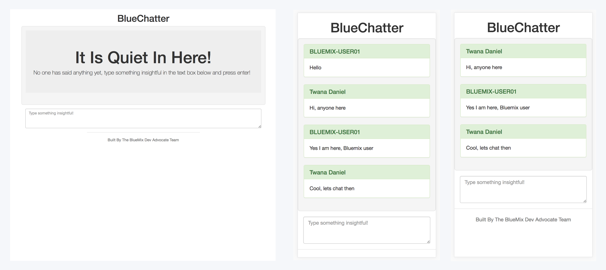
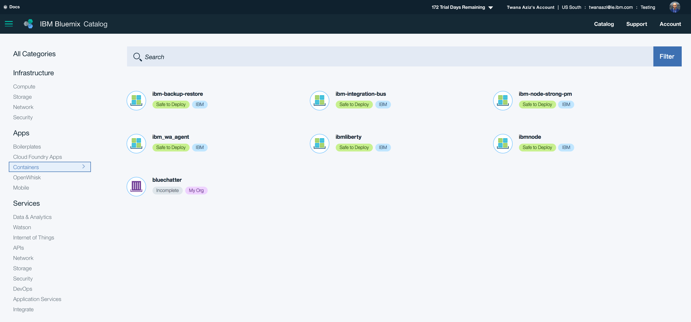
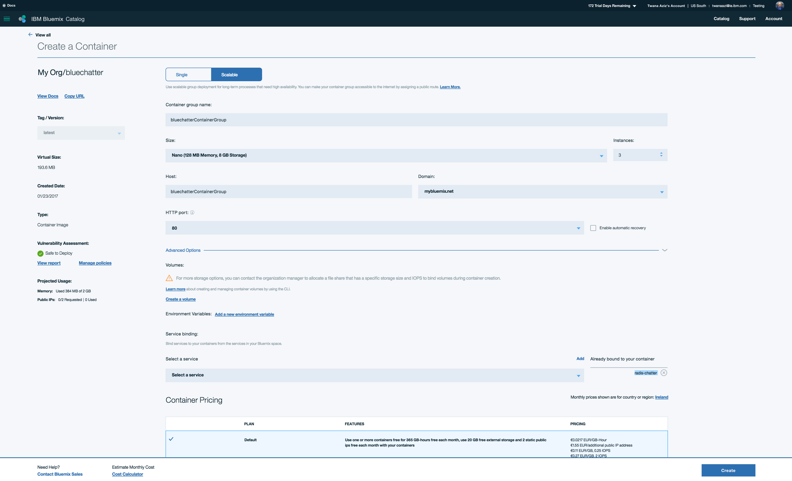
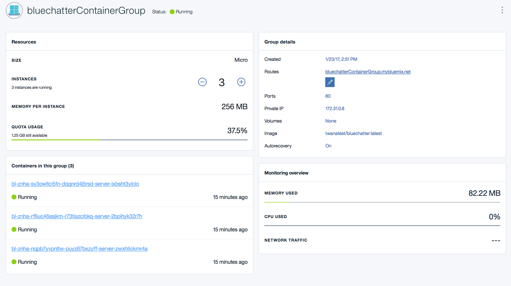
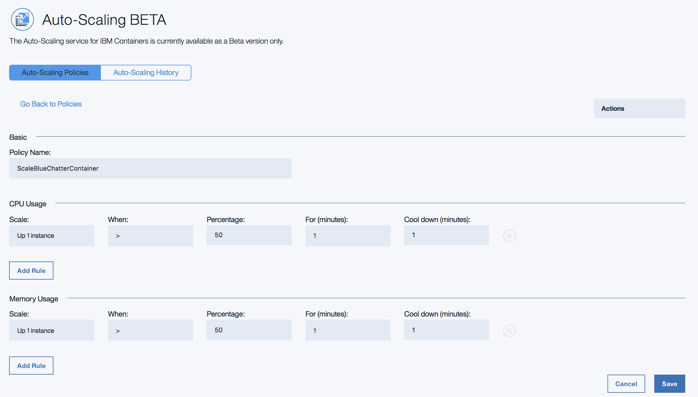
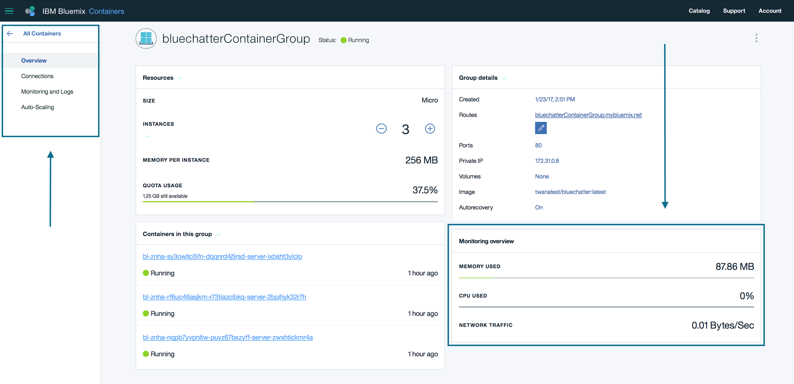
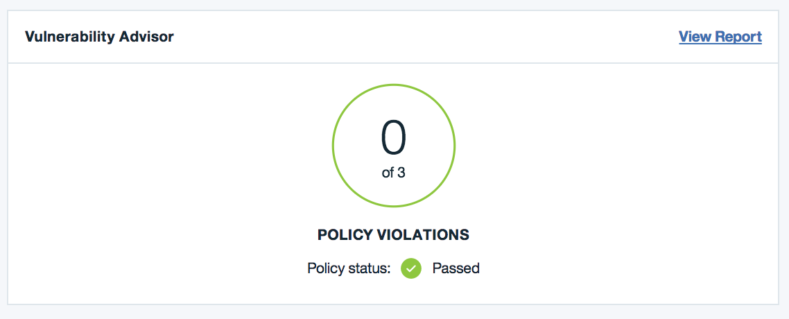
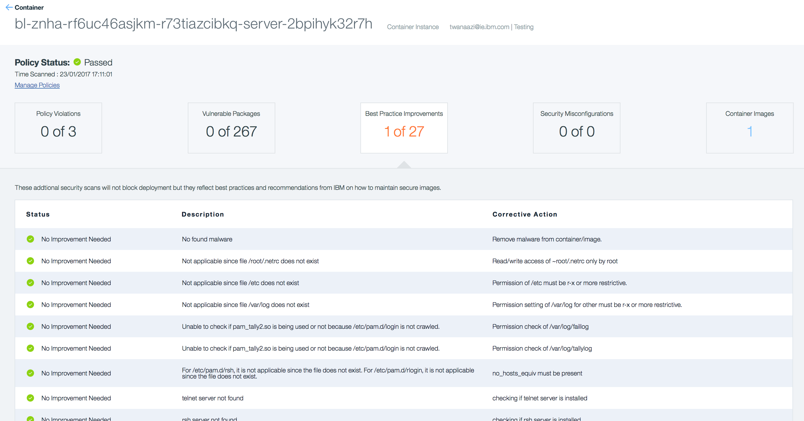

## About
The BlueChatter app is a very simple chat/IRC type application for your browser.
The application is very basic to work with, to use the app, all you need to is to enter your username and start chatting with anyone else that is online at the same time.

See how the browser chat application looks like:



## Technologies
BlueChatter uses [Node.js](http://nodejs.org/) and
[Express](http://expressjs.com/) for the server.  On the frontend
BlueChatter uses [Bootstrap](http://getbootstrap.com/) and
[JQuery](http://jquery.com/).  The interesting part of this application
is how the communication of messages is done.  The application uses [long
polling](http://en.wikipedia.org/wiki/Push_technology#Long_polling) to enable
the clients (browsers) to listen for new messages.  Once the
app loads successfully a client then issues a request to the server.  The server waits to respond
to the request until it receives a message.  If no message is received from any
of the chat participants it responds back to the client with a 204 - no content.
As soon as the client gets a response from the server, regardless of whether that
response contains a message or not, the client will issue another request and
the process continues.

The main goal of this application is to demonstrate the deployment and Scaling of Docker container and Cloud Foundry application on Bluemix. We will look at why and when you should deploy your application to a docker container over the classic Cloud Foundry root. You will learn on how to scale your application, scaling is big factor to any production applications, no matter which root you would take you would still need to scale your application for when traffic spike occur. With using the [IBM Bluemix auto scaling](https://console.ng.bluemix.net/docs/services/Auto-Scaling/index.html) service, we can automatically scale our Cloud Foundry Application or Docker Container application. To forwarder explain what scaling means, all scaling is to have multiple instance of the same application running at the same time, this means all users seen the same application while each user is directed to different instance of the application depending on the number of the instances you scale to.

Another area we should outline is how do the chat messages happen between the different servers, how do all instance of the applications talk to the same database to offer the chat experience to the users like if they are all on one instance?
For that we use the [pubsub feature of Redis](http://redis.io/topics/pubsub) to solve this.  
All the servers will be bound to a single Redis instance and each server is listening for messages on the same channel.
When one chat server receives a chat message it publishes an event to Redis containing the message.  
The other servers then get notifications of the new messages and notify their clients of the.  This design allows BlueChatter to scale nicely to meet the demand of its users.

## Automatically Deploying To Bluemix

The easiest way to deploy BlueChatter is to click the "Deploy to Bluemix" button in which automatically deploys the application to Bluemix.  
[](https://bluemix.net/deploy?repository=https://github.com/IBM-Bluemix/bluechatter)  


Using the Deploy To Bluemix button will automatically setup several things for you.  
First it will create a Git repo in IBM DevOps Services containing the code for the application.
In addition a deployment pipeline will automatically be setup and run which will deploy the
application to Bluemix for you.  The deployment pipeline will both deploy the application as a
Cloud Foundry application and in a Docker container.  Both versions of the application will
share the same route (URL) in Bluemix so hitting that URL you will either be using the Cloud
Foundry application or the Docker container.  In addition to deploying the app using Cloud
Foundry and Docker the pipeline will build a Docker image and place it in your Docker
registry on Bluemix so you can deploy additional containers based on that image if you want.


## 1.0 Cloud Foundry Deployment Approach

1. Create a Bluemix Account  
[Signup](https://console.ng.bluemix.net/registration/?target=%2Fdashboard%2Fapps) for Bluemix, or use an existing account.

1. Download and install the [Cloud-foundry CLI](https://github.com/cloudfoundry/cli) tool

1. If you have not already, [download node.js 6.7.0 or later][https://nodejs.org/download/] and install it on your local machine.

1. Clone the app to your local environment from your terminal using the following command

  ```
  git clone https://github.com/IBM-Bluemix/bluechatter.git
  ```

1. `cd` into the `bluechatter` folder that you cloned

  ```
  cd bluechatter
  ```

1. Edit the `manifest.yml` file and change the application `host` to something unique.

  The host you use will determinate your application url initially, e.g. `<host>.mybluemix.net`.

1. Connect and login to Bluemix
```
$ cf login -a https://api.ng.bluemix.net
```

1. create a Redis service for the app to use, we will use the RedisCloud service.
```
$ cf create-service rediscloud 30mb redis-chatter
```

1. Push the application

  ```
  cf push
  ```

**Done**, now go to the staging domain(`<host>.mybluemix.net`.) and see your app running.


### 1.1 Scaling Your Cloud Foundry Application

Since we are using Redis to send chat messages, you can scale this application as much as you would like and people can be connecting to various servers and still receive chat messages.  We will be looking on how to scale the application runtime instances for when needed, to do this we are going to look at the manual scaling command or use the Auto-Scaling service to automatically increase or decrease the number of application instances based on a policy we set it.

#### Manual Scaling
1. Manually scale the application to run 3 instances
```
$ cf scale my-blue-chatter-app-name -i 3
```

1. Then check your that all your instances are up and running.
```
 $ cf app my-blue-chatter-app-name
```
Now switch over to your staging domain(`<host>.mybluemix.net`.) to see your running application.
Note, you can see see which instance you are connecting to in the footer of the application.  
If you have more than one instance running chances are the instance id will be different between two different browsers.  


#### Auto Scaling
1. It's good to be able to manually scale your application but Manual scaling wont work for many cases, for that reason we need to setup a [Auto-Scaling](https://console.ng.bluemix.net/docs/services/Auto-Scaling/index.html) to automatically scale our application for when needed.
To learn more on Auto-Scaling checkout the blog post [Handle the Unexpected with Bluemix Auto-Scaling](https://www.ibm.com/blogs/bluemix/2015/04/handle-unexpected-bluemix-auto-scaling/) for detailed descreption on [Auto-Scaling](https://console.ng.bluemix.net/docs/services/Auto-Scaling/index.html).


## 2.0 Docker Deployment Approach
Here we are going to look on how to deploy the BlueChatter application on a Docker container where it will be running on IBM Bluemix.
We will then look on how to scale your docker container on Bluemix to scale your application where needed.

First, lets look at running the BlueChatter application inside a Docker container locally on your machine, next we will deploy the container to Bluemix and then scale it for when needed. Lets get started and have fun.

### 2.1 Setup
1. Create a Bluemix Account  
[Signup](https://console.ng.bluemix.net/registration/?target=%2Fdashboard%2Fapps) for Bluemix, or use an existing account.

1. Download and install the [Cloud-foundry CLI](https://github.com/cloudfoundry/cli) tool

1. **Install Docker using the [Docker installer](https://www.docker.com/), once installation completed, test if docker installed by typing the "docker" command in your terminal window, if you see the list of docker commands then you are good to go.**

1. If you have not already, [download node.js 6.7.0 or later][https://nodejs.org/download/] and install it on your local machine.

1. Clone the app to your local environment from your terminal using the following command

  ```
  git clone https://github.com/IBM-Bluemix/bluechatter.git
  ```

1. `cd` into the `bluechatter` folder that you cloned

  ```
  cd bluechatter
  ```


### 2.2 Build & run container locally

1. Build your docker container
```
$ docker-compose build
```

1. Start your docker container
```
$ docker-compose up
```

**Done,** now go to [http://localhost](http://localhost) to see your app running if you are on a Mac Linux.   

1. On Windows you will need the IP address of your Docker Machine VM to test the application.
Run the following command, replacing `machine-name` with the name of your Docker Machine.
```
$ docker-machine ip machine-name
```
Now that you have the IP go to your favorite browser and enter the IP in the address bar,
you should see the app come up.  (The app is running on port 80 in the container.)


### 2.3 Run container on Bluemix
Before running the container on Bluemix, I recommend you to checkout the Docker container Bluemix documentation to better understand the steps below. Please review the [documentation](https://www.ng.bluemix.net/docs/containers/container_index.html) on Bluemix before continuing.

1. Download and install the [Cloud-foundry CLI](https://github.com/cloudfoundry/cli) tool if haven't already.

1. Install the IBM Bluemix Container Service plug-in to execute commands to IBM Bluemix containers from your terminal window.
Install Container Service plug-in by running this command if on OS X.
```
$ cf install-plugin https://static-ice.ng.bluemix.net/ibm-containers-mac
```
If you are on Linux or windows then find the [installation command here](https://console.ng.bluemix.net/docs/containers/container_cli_cfic_install.html)

1. Login to Bluemix with your Bluemix email and password
```
$ cf login -a api.ng.bluemix.net
```

1. Login to the IBM Containers plugin to work with your docker images that are on Bluemix
```
$ cf ic login
```

1. After you have logged in you can build an image for the BlueChatter application on Bluemix.
From the root of BlueChatter application run the following commnand replacing namespace
with your namespace for the IBM Containers service.  (If you don't know what your namespace is
run `$ cf ic namespace get`.)
```
$ cf ic build -t namespace/bluechatter ./
```
The above `build` command will push the code for Bluechatter to the IBM Containers Docker service
and run a `docker build` on that code.  Once the build finishes the resulting image will be
deployed to your Docker registry on Bluemix.  You can verify this by running
```
$ cf ic images
```
You should see a new image with the tag `namespace/bluechatter` listed in the images available to you.
You can also verify this by going to the [catalog](https://console.ng.bluemix.net/catalog/) on Bluemix,
in the containers section you should see the BlueChatter image listed.

1. Our BlueChatter application is using the Redis cloud service to store in memory the chat communication, lets go ahead and great the Redis service.
We can create a service on Bluemix using the Bluemix UI or the terminal using the command below.
Enter this command in your terminal to create the Redis service:
```
$ create-service rediscloud 30mb redis-chatter
```


#### Steps to be done on Bluemix UI
Now we need to switch over to Bluemix UI and complete the steps required to have our docker image running inside a private docker container repository on Bluemix.

Step 1) Go over [Bluemix catalog container](https://console.ng.bluemix.net/catalog/?taxonomyNavigation=apps&category=containerImages) area and click on the "bluechatter" registry that we created. 

Step 2) You have the option to create single or scalable container, in our case we will select the scalable container option to take the full advantage of the scaling capabilities.   
Here are the items you need to select to create the container:  
- Select the scalable option for container type  
- Give your container a name, I named my container bluechatterContainerGroup  
- Select a container size, I selected Nano 128MB 8GB Storage for this example but you can select the size in which best for your setup.
- Select number of instances, I selected 3 instances  
- Host leave it as default  
- HTTP Port should be 80 and enable automatic recovery option if you wish.  
- Last and most important step, bind the Redis service to the container, to do this, click on the **"Advanced Options"** button then scroll down to select and **add** the Redis service.  
- Click on the Create button.



**Done,** with above steps completed, you should have your container running within 2-3 mins.  
Looking at my container screenshot below, we can quickly see everything we need to know about our docker container.  
Note, a staging domain also been created for us with the name of the container group.  



### 2.4 Container Scaling
The Bluemix containers offers a great scaling and reporting functionality where as a developer you really don't need to worry about any of the underlying infrastructure and scaling scripts.
Let's look at how to setup a scaling policies and increasing container instances.

1) To setup Auto-Scaling click on the Auto-Scaling tab on the left side.
2) Click on the create policy button on the bottom right side of the page.
3) Create your scaling policy, see below screenshot to how I setup my scaling policy
4) Finally click on the policy created and click on the Action button to attach the policy to your container
Done.


With above 4 steps you have created your auto scaling policy to increase the number of container instances for when needed.

### 2.5 Reporting
First, at a quick look at the container dashboard we can see the usage of your docker container.
From the dashboard we can see memory used, CPU used and Network traffic.

To get more in depth monitoring and reporting, go over to the monitoring and Logs section.



### 2.6 Vulnerability Advisor
The Bluemix containers services offers a vulnerability report to each one of the containers deployed to Bluemix, this is highly useful as it provides a deep vulnerability insight to your application.
To get to the vulnerability advisor section, from your container dashboard click on any of the container instances and then you should see the vulnerability advisor button on the bottom of the page.   


Looking at the vulnerability advisor section, we can get things like policy violations, vulnerable packages, best practice improvements and security misconfigurations.  
The two parts that I find very useful would be the vulnerable packages and best practice improvements.  
From the list of best practices improvements, I can understand things like weak passwords, list Malware found, permission settings and more.


### 2.7 Why I love working Docker on Bluemix?
- Quick and easy deployment, you can deploy your docker application to Bluemix within less then 5 minutes.
- List of IBM provided docker images and ability to use any other docker images like for example any image from [Docker Hub](https://hub.docker.com/).  
- Really nice and easy scaling capabilities to do manual or automatic scaling
- Easy monitoring and logging dashboard  
- Vulnerability Advisor Dashboard
- Good documentation support on Docker


For additional information about on IBM Containers see the the following links:  
[Bluemix documentation](https://console.ng.bluemix.net/docs/containers/container_index.html)  
[A-Z Video docker container setup](https://www.youtube.com/watch?v=TfCj2qOXb1g)  


## Testing
After the app is deployed you can test it by opening two different browsers
and navigating to the URL of the app.  YOU MUST USE TWO DIFFERENT BROWSERS
AND NOT TWO TABS IN THE SAME BROWSER.  Since we are using long polling
browsers will not actually make the same request to the same endpoint
while one request is still pending.  You can also open the app in a browser
on your mobile device and try it there as well.

## License
This code is licensed under Apache v2.  See the LICENSE file in the root of the repository.

## Dependencies
For a list of 3rd party dependencies that are used see the package.json file in the root of the repository.
